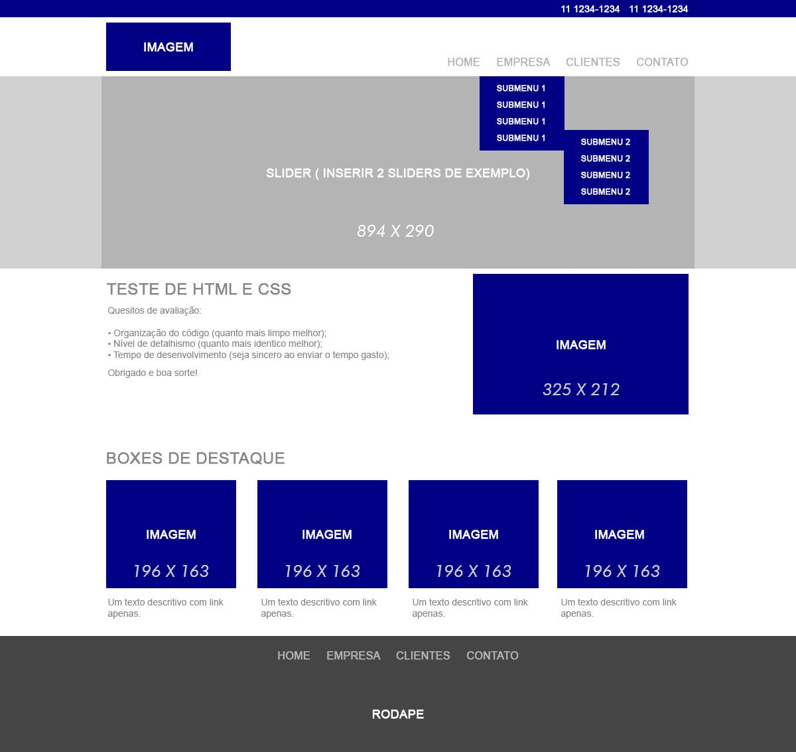
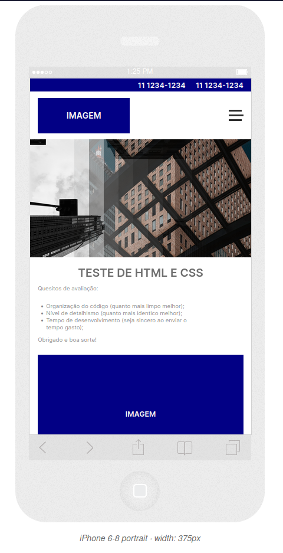
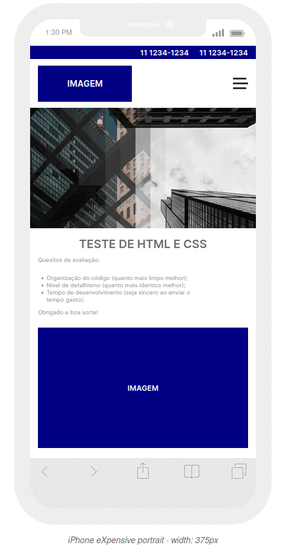
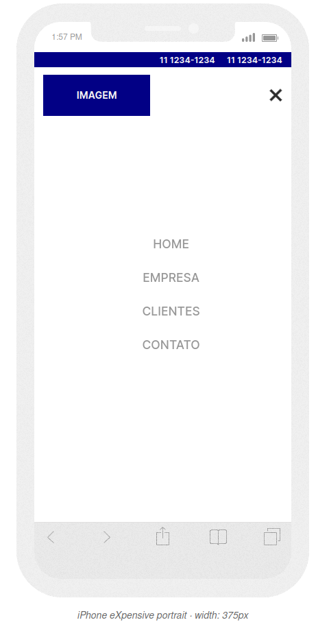
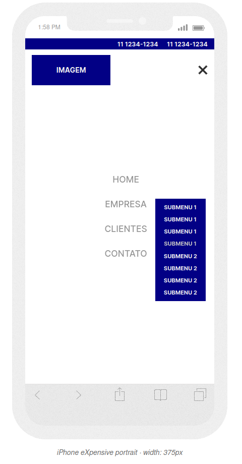
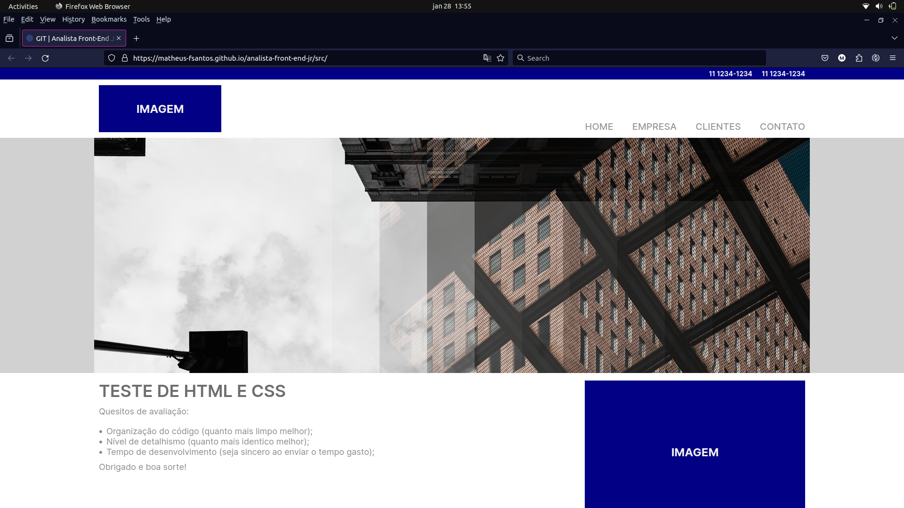
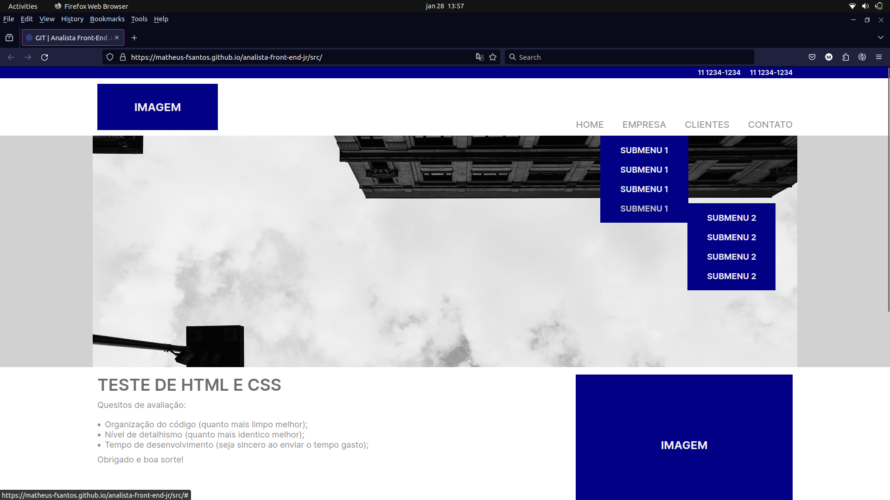
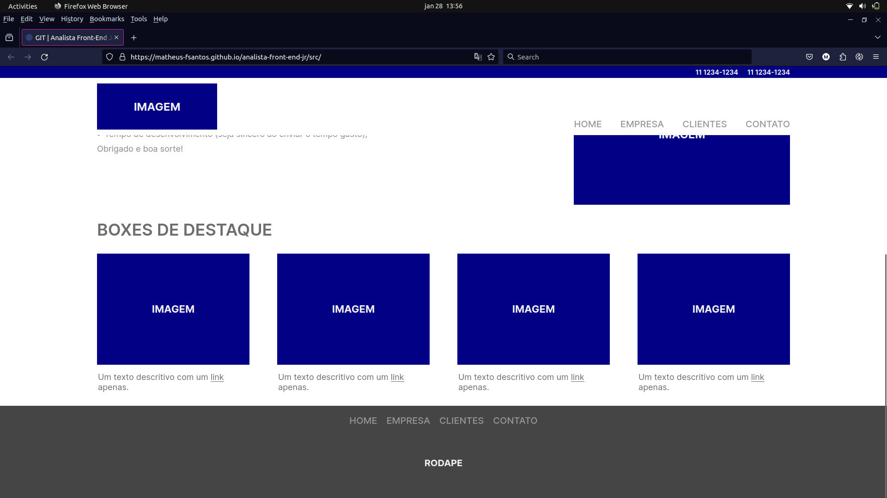

# Análista Front-End Jr

Olá! Me chamo Matheus (acho que você já deve saber kkkkkk), e, se você entrou nesse repositório, estou aqui para te apresentar a minha solução referente ao teste ténico para a vaga de Análista Front-End Júnior.

#### 🎯 - Project Goal

Nesse teste técnico foi me repassado que **eu tinha por objetivo principal**:

1. **Reproduzir**, utilizando HTML5 e CSS3, **de maneira mais fiel** possivel **a seguinte imagem:**    

2. **Me preocupar com a semântica** do HTML5 e fazer uso de "tableless" (quanto menos DIV's melhor);

3. **Implementar uma solução responsiva para o "wireframe"** apresentado, trabalhando com as tão famosas media queries do CSS3 (Indispensável);

4. (Opcional/Preferencia) **Trabalhar com** a biblioteca jQuery **Nivo Slider**, para criação do slider dinamico;

5. **Não fazer uso de bibliotecas adicionais como Bootstrap**, e etc.

#### 🛠️ - Ferramentas Utilizadas

Segui a risca tudo que foi falado acima, e para esse teste técnico utilizei as seguintes ferramentas:

1. **HTML5** (Para criação de toda estrutura da página);
2. **CSS3** (Para a estilização da página, tanto para computador, laptop, tablet e mobile);
3. **JavaScript** (SOMENTE para a NAVBAR responsiva - funcionalidade de ativar e desativar somente);
4. **Nivo Slider** (Para a criação do slider dinamico na página);
5. **Git/GitHub** (Para versionamento do código);
6. **Color Picker (Firefox Extension)** (Para selecionar os HEX das cores do JPG);
7. **Responsinator** (Para testar a responsividade e tirar alguns prints bonitos kkkkkk).
8. **GitHub Pages** (Para fazer deploy da página).

#### 🖥️ - Prints do resultado final

#### 🖊️ - Considerações Finais

Esse teste foi realmente divertido de desenvolver, foi um teste onde eu pude ver que eu realmente entendi boa parte dos conceitos de HTML5 e CSS3 que eu estudei durante uma boa parte desses anos que estudo desenvolvimento de software.

Acredito que a parte em que mais tive dificuldade foi em fazer dropdown, porque era algo que eu nunca tinha feito, um dropdown que contém outro dropdown kkkkkk, porém, consegui implementar da maneira que estava sendo proposto na imagem ilustrativa, tirando isso, consegui aplicar todos os conhecimentos anteriores que já vinha estudando a um bom tempo e me senti realmente preparado para aplicar tudo (ou quase tudo kkkk) de que já tinha estudado.

Enfim, obrigado a todos que estão lendo até aqui (não faço IDÉIA de quantas pessoas são kkkkkkkk) e se o recrutador estiver lendo, obrigado pela oportunidade de mostrar um pouco do meu conhecimento e espero, do fundo do meu coração, conseguir ir adiante no processo seletivo e conquistar essa vaga!

Novamente, valeu a todos e até mais 🧑‍💻

###### Infos.
> Dono do repo.: Matheus-FSantos (eu, hehe) E-Mail: matheus.fs.contato@gmail.com ou matheus.fsantos52@senacsp.edu.br São Paulo/SP - 28 de janeiro de 2024.
